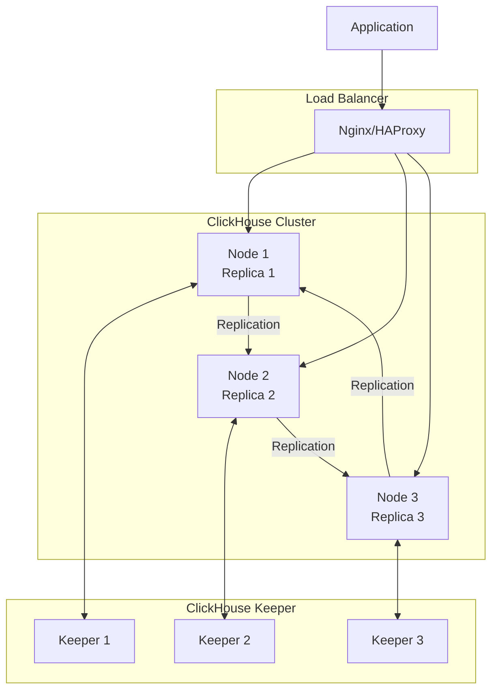

# ClickHouse 单片多副本集群部署方案大纲

## 1. 环境准备阶段

### 1.1 硬件配置确认
- [ ] 确认3台服务器配置：每台4核CPU、16GB内存、150GB NVMe SSD
- [ ] 验证网络带宽：节点间1Gbps，延迟<2ms
- [ ] 检查磁盘性能：每台IOPS > 10,000
- [ ] 确认操作系统：CentOS 7/8 或 Ubuntu 20.04+
- [ ] 验证服务器间网络连通性

### 1.2 系统环境准备
- [ ] 更新所有节点系统包
- [ ] 安装必要依赖包
- [ ] 配置防火墙规则（开放9000、8123、9181端口）
- [ ] 设置系统参数优化
- [ ] 创建专用用户和目录
- [ ] 配置NTP时间同步

### 1.3 网络配置
- [ ] 配置各节点静态IP
- [ ] 设置DNS解析
- [ ] 配置节点间内网通信
- [ ] 配置负载均衡器（可选）
- [ ] 测试节点间网络连通性

## 2. ClickHouse Keeper部署

### 2.1 Keeper集群部署
- [ ] 在3个节点安装ClickHouse Keeper
- [ ] 配置Keeper集群配置文件
- [ ] 设置Keeper节点角色（Leader/Follower）
- [ ] 启动Keeper集群
- [ ] 验证Keeper集群状态

### 2.2 Keeper配置优化
- [ ] 配置Keeper内存参数
- [ ] 设置日志级别和路径
- [ ] 配置快照和日志存储
- [ ] 设置Keeper监控

## 3. ClickHouse集群安装配置

### 3.1 安装ClickHouse
- [ ] 在所有节点添加ClickHouse官方仓库
- [ ] 安装ClickHouse Server和Client
- [ ] 验证安装完整性
- [ ] 配置systemd服务

### 3.2 集群配置
- [ ] 配置config.xml主配置文件
- [ ] 设置集群拓扑结构
- [ ] 配置副本关系
- [ ] 设置用户和权限
- [ ] 配置日志路径和级别

### 3.3 性能优化配置
- [ ] 内存配置优化（每节点16GB）
- [ ] CPU线程池配置
- [ ] 磁盘IO优化
- [ ] 网络参数调优
- [ ] 查询缓存配置

## 4. 集群初始化

### 4.1 创建集群结构
- [ ] 创建分布式数据库
- [ ] 设计表结构（基于JSON数据）
- [ ] 设置分区策略
- [ ] 配置索引优化
- [ ] 设置TTL策略

### 4.2 副本配置
- [ ] 配置副本同步策略
- [ ] 设置副本健康检查
- [ ] 配置副本故障转移
- [ ] 设置副本数据一致性检查

### 4.3 权限配置
- [ ] 创建应用用户
- [ ] 设置数据库权限
- [ ] 配置行级安全策略
- [ ] 设置连接限制

## 5. 集群启动和验证

### 5.1 集群启动
- [ ] 按顺序启动各节点服务
- [ ] 检查集群状态
- [ ] 验证副本同步状态
- [ ] 测试集群连接

### 5.2 功能验证
- [ ] 执行基础查询测试
- [ ] 验证JSON查询功能
- [ ] 测试分布式查询性能
- [ ] 验证数据写入和复制

### 5.3 高可用性测试
- [ ] 测试节点故障转移
- [ ] 验证数据一致性
- [ ] 测试自动故障恢复
- [ ] 验证读写分离功能

## 6. 负载均衡配置

### 6.1 负载均衡器部署
- [ ] 部署Nginx或HAProxy
- [ ] 配置负载均衡规则
- [ ] 设置健康检查
- [ ] 配置会话保持

### 6.2 读写分离配置
- [ ] 配置读请求分发
- [ ] 设置写请求路由
- [ ] 配置故障转移
- [ ] 测试负载均衡效果

## 7. 监控和运维配置

### 7.1 集群监控系统
- [ ] 安装Prometheus监控
- [ ] 配置ClickHouse Exporter
- [ ] 部署Grafana仪表板
- [ ] 设置集群监控告警

### 7.2 日志管理
- [ ] 配置集中式日志收集
- [ ] 设置日志轮转
- [ ] 配置日志级别
- [ ] 设置日志保留策略

### 7.3 备份策略
- [ ] 配置集群备份脚本
- [ ] 设置备份存储位置
- [ ] 配置备份验证
- [ ] 设置备份恢复测试

## 8. 安全配置

### 8.1 网络安全
- [ ] 配置SSL/TLS加密
- [ ] 设置防火墙规则
- [ ] 配置VPN访问
- [ ] 设置访问白名单

### 8.2 数据安全
- [ ] 配置数据加密
- [ ] 设置审计日志
- [ ] 配置敏感数据脱敏
- [ ] 设置数据访问控制

## 9. 应用集成

### 9.1 应用连接配置
- [ ] 配置应用连接池
- [ ] 设置负载均衡连接
- [ ] 配置重试机制
- [ ] 设置连接监控

### 9.2 数据同步配置
- [ ] 配置数据源连接
- [ ] 设置同步策略
- [ ] 配置错误处理
- [ ] 设置同步监控

## 10. 运维文档

### 10.1 操作手册
- [ ] 编写集群启动停止流程
- [ ] 编写节点故障处理指南
- [ ] 编写性能调优指南
- [ ] 编写扩容升级指南

### 10.2 应急预案
- [ ] 制定节点故障恢复流程
- [ ] 设置集群告警通知机制
- [ ] 准备应急联系方式
- [ ] 制定数据恢复方案

## 11. 上线部署

### 11.1 生产环境部署
- [ ] 执行完整集群部署流程
- [ ] 进行最终功能验证
- [ ] 执行性能压力测试
- [ ] 确认集群稳定性

### 11.2 应用切换
- [ ] 配置应用连接负载均衡
- [ ] 执行数据迁移
- [ ] 进行功能验证
- [ ] 监控集群运行状态

## 12. 后续维护

### 12.1 日常运维
- [ ] 定期集群性能监控
- [ ] 定期安全更新
- [ ] 定期备份验证
- [ ] 定期容量规划

### 12.2 扩容准备
- [ ] 监控集群资源使用情况
- [ ] 制定扩容计划
- [ ] 准备扩容方案
- [ ] 设置扩容触发条件

---

## 部署时间计划

| 阶段 | 预计时间 | 负责人 | 备注 |
|------|----------|--------|------|
| 环境准备 | 2天 | 系统管理员 | 包含3台服务器配置 |
| Keeper部署 | 1天 | DBA | 包含集群配置 |
| ClickHouse安装配置 | 2天 | DBA | 包含集群拓扑配置 |
| 集群初始化 | 1天 | DBA | 包含副本配置 |
| 集群验证 | 1天 | DBA + 开发 | 包含高可用测试 |
| 负载均衡配置 | 1天 | 运维工程师 | 包含读写分离 |
| 监控部署 | 1天 | 运维工程师 | 包含集群监控 |
| 安全配置 | 1天 | 安全工程师 | 包含审计配置 |
| 应用集成 | 1天 | 开发工程师 | 包含连接测试 |
| 上线部署 | 1天 | 全体团队 | 包含最终验证 |

**总计：11天**

## 集群架构图

